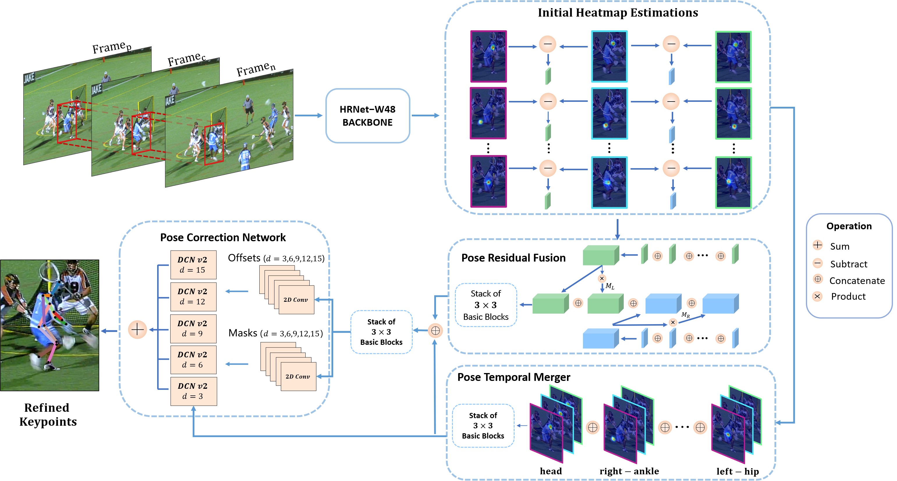

# DCPose修改

该模型发布于CVPR2021，其环境为python-3.6.12，torch-1.4.0，CUDA-10.0，Ubuntu-18.04。使用了两块NVIDIA 2080Ti GPUs。

原文链接：https://github.com/Pose-Group/DCPose.git

该模型检测器采用了YOLOv3，由于环境配置问题，不能在windows和30系显卡上运行。

故对其进行修改，将检测器换为YOLOv8，可以在python-3.8.18，torch-1.13.1，CUDA-11.7，Windows 11，NVIDIA 3050Ti上运行，效果如下：

模型结构如下（源自原作者）：

注：对该模型的修改仅为了更好地理解模型结构和姿态估计思路
